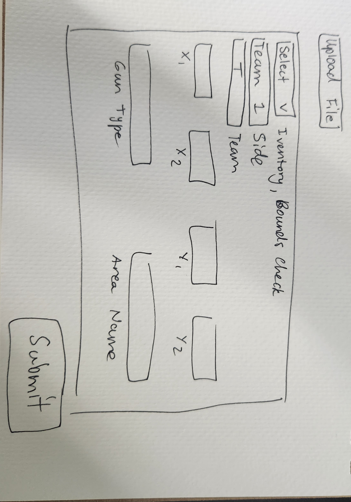

# My EG Software Engineering Internship Project

## Question Answers:

### Question 1:
#### Part A:
Currently the class takes the parquet file name or location as an input and then uses that to convert it to a DataFrame. This could be adapted so that any file type compatible with DataFrames could be used as an input. 
#### Part B:
Currently, since the prompt did not specify how it wanted the data returned, the function withinBound takes the filename, x1, y1, x2, y2, maxz, minz, team, side as inputs. The filename and coordinates are told to be inputs from the provided PDF, and the team and side are there just to answer Question 2A. The output is in the format of a new DataFrame that has the coordinates that were within the given bound and the round number to give a reference point to answer question 2A. This could easily be converted to maintain the data from the other columns as well, but I was unsre how much information we wanted it to return. 
#### Part C:
Similarly to Part B, my inputs came from the parquet filename and information needed to generate answers to Question 2 - filename, team, and side. Once again, I was unsure how much information we wanted to return alongside the extracted weapon class, so I just returned a datafram with the extracted items, round number, and player to give a solid reference point. Input parameters can be changed to see how the inventory results differ, but for now it just shows Team 2 on the Terrorist side. 

### Question 2:
#### Part A:
Based on the output of my call for `print(ProcessGameStrategy.withinBound(parquet_file, -1735, 250,-2472, 1233, 421, 285,"Team2","T"))` in the Python program, and the output DataFrame only showing that there were two rounds (16 and 17) where players were within light blue boundary, it appears that this was not a common strategy used by Team 2 on their T side as it was only used very early into the half such as the pistol and follow-up round. 

#### Part B:
While I finished a first attempt implementation at this question, there were bugs I ran out of time to work out as when you run the script, for some reason the analysis of the inventory did in fact search for the desired elements, but the indexing somehwere never allowed it to pass over 2, so attempting to narrow down the list did not work. If you uncomment the `print(times)` in line 129, it shows the times I was checking that at least were when there were *at least* two players alive entering BombsiteB. These times were [1:05, 1:35, 0:13, 1:23, 1:17], which when averaged give a time of ~1:08. 

#### Part C:
As stated below (in Personal Circumstances), I ran out of time to fully implement everything I would have hoped, and this is the main question I fell short on completing. With this, I instead can only explain what I would have done. I would have specified different input parameters for the withinBound() call to see what coordinate players on the Team 2 CT side fell within the BombsiteB (aka where within the site they were) and then used that output dataframe to generate a heatmap as the question suggested, specifically using the seaborn class as it matches the output DataFrame perfectly without too much manipulation. This method would have required though the coordinates of the BombsiteB instead of using the area_name parameter which I perhaps could have worked out using the given ones and trigonmetry. 

### Question 3:
While I am still an early software engineer and might not be able to properly gauge the implementation time for my idea, I would say to adapt the class and scripts I have written into a web application using a Python-based web development framework like Flask or Django. My work already demonstrates how simple it is to get different outputs based on the information you provide to the program, and a friendly UI plus more data-checking measures would enable the creation of a graphic table essentially where coahcing staff could select drop-downs for the type of data they want to analyze, which could then prompt them for the correct inputs. They would then upload the parquet file (assuming that is where we are starting from) and submit the form, which would then generate the outputs they need, whether in numerical form or something more friendly depending on the abstraction required. 
 

## Personal Circumstances: 
This past weekend, I was both sick and menstrating, but I wanted to respect the request to not ask for additional time for any circumstances as specififed in the initial email, so I apoligize for the incompletion or poor quality of my assesment. I hope I demonstrated enough understanding and thought processes to show you what I really know in the technial/behavioral interview and beyond, but I know I am capable of more than what is demonstarted here as there were many periods this weekend that I could have been working on the assesment, but I was instead confined to my bed unable to move (severe cramps) or breath (that sounds bad, but it was more severe congestion issues). Furthermore, the holiday and some miscommunication about how to email did lead to a delay in getting answers to my question before I fell ill (additional time I could have spent on the assesment). Thank you for taking the time to consider my work. 
